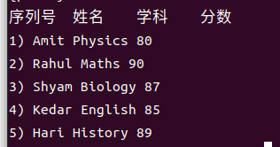
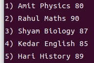
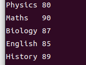
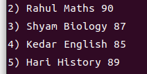
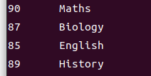
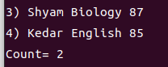
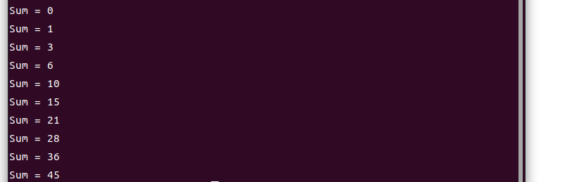
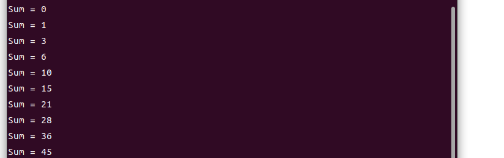

# awk

awk 是  上最著名的文本处理工具之一。它非常强大，使用简单的编程语言。它可以用几行代码解决复杂的文本处理任务。awk 的名字来自作者的姓氏——**Alfred Aho**，**Peter Weinberger** 和 **Brian Kernighan**。awk 的 GNU/Linux 分发版本由 Free Software Foundation(FSF) 开发和维护；该版本通常被称为 GNU awk。

awk 有三个变体：

+ awk 原始的来自 AT&T 实验室的 awk
+ nawk 来自 AT&T 实验室的新的改进版 awk
+ gawk GNU awk。所有 GNU/Linux 发行版都提供 gawk。 与 awk 和 nawk 完全兼容。

awk 可以做的工作包括但不仅限于：

+ 文本处理
+ 生成格式化的文本报告
+ 执行算术运算
+ 执行字符串操作等等

## awk 工作流

```flow
st=>start: 从BEGIN块开始执行 awk 命令
oprd=>operation: 从输入流中读取一行
opex=>operation: 在读取的行上执行 awk 命令
endcd=>condition: 读取结束？
ed=>end: 在END块执行 awk 命令

st->oprd->opex->endcd
endcd(yes)->ed
endcd(no)->oprd
```


awk 的执行流程很简单，从BEGIN块中的命令开始，逐行读取，对读取的每一行执行 awk 命令直到读取结束，最后执行 END块中的命令。

awk 的程序结构包括 BEGIN块，Body块以及END块。

```shell
BEGIN {awk-commands}
#BEGIN块在程序启动时执行。它只执行一次。这是初始化变量的好地方。BEGIN是一个AWK关键字，因此必须使用大写。请注意，此块是可选的。 
/pattern/ {awk-commands}
#Body块在每个输入行上应用AWK命令。默认情况下，AWK在每行上执行命令。可以通过提供模式来限制这一点。请注意，Body块没有关键字。
END {awk-commands}
#END块在程序结束时执行。END是一个AWK关键字，因此必须使用大写。请注意，此块是可选的。
```

假定有一个名为 **marks.txt** 文件，其中包含序列号，姓名，科目以及分数。

```
1)  Amit    Physics  80
2)  Rahul   Maths    90
3)  Shyam   Biology  87
4)  Kedar   English  85
5)  Hari    History  89
```

使用 awk 输出带表头的文件内容。

```shell
$ awk 'BEGIN{printf "序列号\t姓名\t学科\t分数\n"} {print}' marks.txt
```

输出如下



## awk 基本语法与例子

可以在命令行中以单引号指定 awk 命令，例如：

```shell
$ awk '{print}' marks.txt
```

也可以在脚本文件中提供 awk 命令：

```shell
# 首先，创建一个名为 command.awk 的文本文件，包含一行 awk 命令
# {print}
# 然后，执行如下命令
$ awk -f command.awk marks.txt
```

命令输出如下



### awk标准选项

+ **-v** 为一个变量指定一个值。允许在程序执行之前指定。

```shell
$ awk -v name=Jerry 'BEGIN{printf "Name = %s\n", name}'
```

输出

```shell
Name = Jerry
```

+ **--dump-variables[=file]** 它将全局变量及其最终值的排序列表打印到文件中。默认文件是 **awkvars.out**。

```shell
$ awk --dump-variables ''
$ cat awkvars.out
```

输出

```shell
ARGC: 1
ARGIND: 0
ARGV: array, 1 elements
BINMODE: 0
CONVFMT: "%.6g"
ENVIRON: array, 63 elements
ERRNO: ""
FIELDWIDTHS: ""
FILENAME: ""
FNR: 0
FPAT: "[^[:space:]]+"
FS: " "
FUNCTAB: array, 41 elements
IGNORECASE: 0
LINT: 0
NF: 0
NR: 0
OFMT: "%.6g"
OFS: " "
ORS: "\n"
PREC: 53
PROCINFO: array, 29 elements
RLENGTH: 0
ROUNDMODE: "N"
RS: "\n"
RSTART: 0
RT: ""
SUBSEP: "\034"
SYMTAB: array, 28 elements
TEXTDOMAIN: "messages"
```

+ **--help** 打印帮助信息。
+ **--lint[=fatal]** 此选项允许检查不可移植或可疑的构造。当提供 fatal 参数时，它将警告消息视为错误。以下示例说明了这一点：

```shell
$ awk --lint '' /bin/ls
```

输出

```shell
awk: 命令行:1: 警告： 命令行中程序体为空
awk: 命令行:1: 警告： 源文件不以换行符结束
awk: 警告： 完全没有程序正文！
```

+ **--posix** 此选项启用严格的POSIX兼容性，其中禁用所有通用和gawk特定扩展。
+ **--profile[=file]** 此选项在文件中生成程序的优雅打印版本。默认文件是 **awkprof.out**。

```shell
$ awk --profile 'BEGIN{printf"---|Header|--\n"} {print} 
END{printf"---|Footer|---\n"}' marks.txt > /dev/null 
$ cat awkprof.out
```

输出

```shell
	# gawk 配置, 创建 Fri Dec 23 20:23:06 2022

	# BEGIN 规则

	BEGIN {
     1  	printf "---|Header|--\n"
	}

	# 规则

     5  {
     5  	print
	}

	# END 规则

	END {
     1  	printf "---|Footer|---\n"
	}


```

+ **--traditional** 该选项将禁用所以 gawk特定扩展。
+ **--version** 打印 awk 的版本信息。

### 打印列或者域

可以命令 awk 从输入域中打印特定的列。假如想要打印 **marks.txt** 中的第三列和第四列，则使用下面的命令：

```shell
$ awk '{print $3 "\t" $4}' marks.txt
```

输出



### 打印所有行

默认地，awk 打印所有匹配 pattern 的行。

```shell
$ awk '/a/ {print $0}' marks.txt
```

输出



在上面的示例中，我们正在搜索模式a。当模式匹配成功时，它将从Body块执行命令（打印当前匹配行，$0代表匹配的整行）。如果没有Body块，则采取默认操作，即打印记录。因此，以下命令产生相同的结果

```shell
$ awk '/a/' marks.txt
```

### 根据模式打印列

将上面两个例子组合起来，可以根据模式是否匹配打印列。

```shell
$ awk '/a/ {print $4 "\t" $3}' marks.txt
```

输出



### 统计超过18个字符的行

统计超过18个字符的行的数量并打印。

```shell
$ awk 'BEGIN{cnt=0} length($0)>18 {cnt++;print $0} END{print "Count=",cnt}' marks.txt
```

输出



## awk 内置变量

awk 提供了了一些内置变量。这些变量在 awk 脚本中发挥了重要作用。

**ARGC**

在命令行中传递给 awk 的参数的个数。

```shell
$ awk 'BEGIN {print "Arguments =", ARGC}' One Two Three Four
```

输出

```shell
Arguments = 5
```

**ARGV**

一个存储命令行参数的数组。有效的索引范围从0到 ARGC-1。

```shell
$ awk 'BEGIN { 
   for (i = 0; i < ARGC - 1; ++i) { 
      printf "ARGV[%d] = %s\n", i, ARGV[i] 
   } 
}' one two three four
```

输出

```shell
ARGV[0] = awk
ARGV[1] = one
ARGV[2] = two
ARGV[3] = three
```

**CONVFMT**

数字的转换格式。默认值是 `%.6g`。

```shell
$ awk 'BEGIN { print "Conversion Format =", CONVFMT }'
```

输出

```shell
Conversion Format = %.6g
```

**ENVIRON**

环境变量的关联数组。

```shell
$ awk 'BEGIN{print ENVIRON["SHELL"]}'
```

输出

```shell
/bin/bash
```

**FILENAME**

当前文件名。

```shell
$ awk 'END {print FILENAME}' marks.txt
```

输出

```shell
marks.txt
```

**FS**

输入域的分隔符，默认是空格。可以通过 -F 选项指定。

```shell
$ awk 'BEGIN {print "FS="FS}'|cat -vte
$ awk -F, 'BEGIN {print "FS="FS}'|cat -vte
```

输出

```shell
FS= $
FS=,$
```

**NF**

当前记录的域的数量。例如，下面的例子打印域的数量超过2的行。

```shell
echo -e "One Two\nOne Two Three\nOne Two Three Four" | awk 'NF > 2'
```

输出

```shell
One Two Three
One Two Three Four
```

**NR**

当前记录的序号。例如，下面的例子打印行号小于3的记录（行号从1开始）。

```shell
$ echo -e "One Two\nOne Two Three\nOne Two Three Four" | awk 'NR < 3'
```

输出

```shell
One Two
One Two Three
```

**FNR**

类似于 NR，但是相对于当前文件进行计数。 在 awk 处理多个文件时是非常有效的。FNR 的值在处理新文件时会重置。

**OFMT**

它表示输出格式编号，默认值为 %.6g。

```shell
$ awk 'BEGIN {print "OFMT = " OFMT}'
```

输出

```shell
OFMT = %.6g
```

**OFS**

输出域分隔符，默认是空格。

```shell
$ awk 'BEGIN {print "OFS = " OFS}' | cat -vte
```

输出

```shell
OFS =  $
```

**ORS**

输出记录分隔符默认是换行符。

```shell
$ awk 'BEGIN {print "ORS = " ORS}' | cat -vte
```

输出

```shell
ORS = $
$
```

**RLENGTH**

它表示 match 函数匹配的字符串的长度。awk 的 match 函数在输入字符串中搜索给定的字符串。

```shell
$ awk 'BEGIN { if (match("One Two Three", "re")) { print RLENGTH } }'
```

输出

```shell
2
```

**RS**

输入记录分隔符默认是换行符。

```shell
$ awk 'BEGIN {print "RS = " RS}' | cat -vte
```

输出

```shell
RS = $
$
```

**RSTART**

match 函数匹配的字符串的首个位置。

```shell
$ awk 'BEGIN { if (match("One Two Three", "Thre")) { print RSTART } }'
```

输出

```shell
9
```

**SUBSEP**

 它表示数组下标的分隔符默认值是**\034**

```shell
$ awk 'BEGIN { print "SUBSEP = " SUBSEP }' | cat -vte
```

输出

```shell
SUBSEP = ^\$
```

**$0 与 $n**

分别代表当前处理的记录以及由 FS 分隔的 n 个域中的第 n 个。

**下面的变量是 GNU awk 特定的变量**

**ARGIND**

当前被处理的文件在 ARGV 中的索引。

```shell
$ awk '{ 
   print "ARGIND   = ", ARGIND; print "Filename = ", ARGV[ARGIND] 
}' junk1 junk2 junk3
```

输出

```shell
ARGIND   =  1
Filename =  junk1
ARGIND   =  2
Filename =  junk2
ARGIND   =  3
Filename =  junk3
```

**BINMODE**

它用于为非POSIX系统上的所有文件I/O指定二进制模式。数值1、2或3分别指定输入文件、输出文件或所有文件应使用二进制I/O。r或w的字符串值分别指定输入文件或输出文件应使用二进制I/O。rw或wr的字符串值指定所有文件都应使用二进制I/O。

**ERRNO**

字符串指示当 getline 的重定向失败或 close 调用失败时发生的错误。

```shell
$ awk 'BEGIN { ret = getline < "junk.txt"; if (ret == -1) print "Error:", ERRNO }'
```

输出

```shell
Error: 没有那个文件或目录
```

**FIELDWIDTHS**

设置了字段宽度变量的空格分隔列表，gawk 将输入解析为固定宽度的字段，而不是使用FS变量的值作为字段分隔符。

**IGNORECASE**

如果该变量被设置，则 awk 变为大小写不敏感的。

```shell
$ awk 'BEGIN{IGNORECASE = 1} /amit/' marks.txt
```

输出

```
1) Amit  Physics   80
```

**LINT**

它提供 gawk 程序中 --lint 选项的动态控制。设置此变量后，gawk 将打印 lint 警告。当指定字符串值 fatal 时，lint警告会变成致命错误，就像 --lint=fatal 一样。 

```shell
$ awk 'BEGIN {LINT = 1; a}'
```

输出

```shell
awk: 命令行:1: 警告： 引用未初始化的变量“a”
awk: 命令行:1: 警告： statement has no effect
```

**PROCINFO**

关于进程信息的关联数组，包含真实和有效UID，进程ID等等。

```shell
$ awk 'BEGIN { print PROCINFO["pid"] }'
```

输出

```shell
33814
```

**TEXTDOMAIN**

它表示AWK程序的文本域，用于查找程序字符串的本地化翻译。

```shell
$ awk 'BEGIN { print TEXTDOMAIN }'
```

输出

```shell
messages
```

## 运算符

与其他语言类似，awk 也支持多种运算符。

### 算术运算符

awk 支持加（+），减（-），乘（*），除（/）以及取模（%）五种算术运算符。

```shell
$ awk 'BEGIN{a=50;b=20;print "(a+b)=",a+b,"(a-b)=",a-b,"(a*b)=",a*b,"(a/b)=",a/b,"(a%b)=",a%b}'
```

输出

```shell
(a+b)= 70 (a-b)= 30 (a*b)= 1000 (a/b)= 2.5 (a%b)= 10
```

### 自增自减运算符

自增（++），自减（--）运算符，在操作数之前与之后对运算结果的影响与C语言相同。

```shell
$ awk 'BEGIN{a=10;b=a++;printf "a=%d,b=%d\n",a,b}'
$ awk 'BEGIN{a=10;b=++a;printf "a=%d,b=%d\n",a,b}'
$ awk 'BEGIN{a=10;b=a--;printf "a=%d,b=%d\n",a,b}'
$ awk 'BEGIN{a=10;b=--a;printf "a=%d,b=%d\n",a,b}'
```

输出

```shell
a=11,b=10
a=11,b=11
a=9,b=10
a=9,b=9
```

### 赋值运算符

awk 支持 =，+=，-=，*=，/=，^=，\*\*= 五种赋值运算符。

```shell
$ awk 'BEGIN { cnt = 100; cnt += 100;printf "cnt=%d\n",cnt }'
$ awk 'BEGIN { cnt = 100; cnt -= 100;printf "cnt=%d\n",cnt }'
$ awk 'BEGIN { cnt = 100; cnt *= 100;printf "cnt=%d\n",cnt }'
$ awk 'BEGIN { cnt = 100; cnt /= 100;printf "cnt=%d\n",cnt }'
$ awk 'BEGIN { cnt = 100; cnt ^= 2;printf "cnt=%d\n",cnt }'
$ awk 'BEGIN { cnt = 100; cnt **= 2;printf "cnt=%d\n",cnt }'
```

输出

```shell
cnt=200
cnt=0
cnt=10000
cnt=1
cnt=10000
cnt=10000
```

### 关系运算符

awk 支持 ==，!=，<，>，<=，>= 六种关系运算符

### 逻辑运算符

支持 &&，||，! 三种逻辑运算符。

### 三目运算符

`condition expression ? statement1 : statement2`

```shell
$ awk 'BEGIN { a = 10; b = 20; (a > b) ? max = a : max = b; print "Max =", max}'
```

输出

```shell
Max = 20
```

### 单目运算符

支持 +，-。将单个操作数乘以+1或者-1。

```shell
$ awk 'BEGIN { a = -10; a = +a; print "a =", a }'
$ awk 'BEGIN { a = -10; a = -a; print "a =", a }'
```

输出

```shell
a = -10
a = 10
```

### 指数运算符

支持 \*\* 或者 ^。

```shell
$ awk 'BEGIN { a = 10; a = a ^ 2; print "a =", a }'
$ awk 'BEGIN { a = 10; a = a**2; print "a =", a }'
```

输出

```shell
a = 100
a = 100
```

### 字符串连接运算符

空格可以用来连接两个字符串。

```shell
$ awk 'BEGIN { str1 = "Hello, "; str2 = "World"; str3 = str1 str2; print str3 }'
```

输出

```shell
Hello, World
```

### 数组成员运算符

**in**。

```shell
$ awk 'BEGIN { 
   arr[0] = 1; arr[1] = 2; arr[2] = 3; for (i in arr) printf "arr[%d] = %d\n", i, arr[i]
}'
```

输出

```shell
arr[0] = 1
arr[1] = 2
arr[2] = 3
```

### 正则表达式运算符

**~** 与 **!~**。搜索包含或不包含匹配字符串的域。

```shell
$ awk '$0 ~ 9' marks.txt
```

输出

```shell
2) Rahul Maths 90
5) Hari History 89
```

不匹配搜索

```shell
$ awk '$0 !~ 9' marks.txt
```

输出

```shell
1) Amit Physics 80
3) Shyam Biology 87
4) Kedar English 85
```

## 正则表达式

awk 在处理正则表达式时是非常强大和高效的。许多复杂的任务可以通过简单的正则表达式完成。

| 符号 | 含义                             |
| ---- | -------------------------------- |
| .    | 匹配除了换行符以外的任意单个字符 |
| ^    | 匹配每行的开始                   |
| $    | 匹配每行的结束                   |
| []   | 匹配中括号内的字符               |
| [^]  | 不匹配中括号内的字符             |
| \|   | 逻辑或                           |
| ?    | 匹配前面的字符至多一次           |
| *    | 匹配前面的字符0次或多次          |
| +    | 匹配前面的字符至少一次           |
| ()   | 分组匹配                         |

```shell
$ echo -e "cat\nbat\nfun\nfin\nfan" | awk '/f.n/'
#匹配fun，fin，fan
$ echo -e "This\nThat\nThere\nTheir\nthese" | awk '/^The/'
#匹配The开头的行
$ echo -e "knife\nknow\nfun\nfin\nfan\nnine" | awk '/n$/'
#匹配n结尾的行
$ echo -e "Call\nTall\nBall" | awk '/[CT]all/'
#匹配Call、Tall
$ echo -e "Call\nTall\nBall" | awk '/[^CT]all/'
#不匹配Call、Tall
$ echo -e "Call\nTall\nBall\nSmall\nShall" | awk '/Call|Ball/'
#匹配Call或者Ball
$ echo -e "Colour\nColor" | awk '/Colou?r/'
#匹配Colour或者Color
$ echo -e "ca\ncat\ncatt" | awk '/cat*/'
#匹配ca之后任意数量的t
$ echo -e "111\n22\n123\n234\n456\n222"  | awk '/2+/'
#至少匹配一个2
$ echo -e "Apple Juice\nApple Pie\nApple Tart\nApple Cake" | awk '/Apple (Juice|Cake)/'
#匹配Apple Juice或者Apple Cake
```

以之前的 **marks.txt** 为例

```shell
#匹配第二列包含Am的行
$ awk '$2 ~ /Am/{print $0}' marks.txt
#匹配分数超过88分的行
$ awk '$4 >= 88 {print $0}' marks.txt
#输出偶数行
$ awk 'NR%2==0 {print $0}' marks.txt
#匹配 English 或 History
$ awk '$3 ~ /English|History/' marks.txt
#输出第二到第三行
$ awk '$1 ~ /2/,/3/{printf "name: %s,marks: %d\n",$2,$4}' marks.txt
```

## 数组

awk 支持关联数组，该数组的索引不需要是连续的数字。可以使用字符串或者数字作为数组索引。同时，也不需要提前声明数组大小，数组可以在运行时扩张/收缩。

**语法**

```shell
array_name[index] = value
delete array_name[index]
```

**创建数组**

```shell
awk 'BEGIN {
   fruits["mango"] = "yellow";
   fruits["orange"] = "orange"
   print fruits["orange"] "\n" fruits["mango"]
}'
```

**删除数组元素**

```shell
$ awk 'BEGIN {
   fruits["mango"] = "yellow";
   fruits["orange"] = "orange";
   delete fruits["orange"];
   print fruits["orange"]
}'
```

**多维数组**

awk 仅支持一维数组。但是可以通过一维数组简单模拟多维数组。

例如，假定一个3*3的二维数组

```shell
100   200   300
400   500   600
700   800   900
```

通过字符串来模拟二维的情况

```shell
$ awk 'BEGIN {
   array["0,0"] = 100;
   array["0,1"] = 200;
   array["0,2"] = 300;
   array["1,0"] = 400;
   array["1,1"] = 500;
   array["1,2"] = 600;

   # print array elements
   print "array[0,0] = " array["0,0"];
   print "array[0,1] = " array["0,1"];
   print "array[0,2] = " array["0,2"];
   print "array[1,0] = " array["1,0"];
   print "array[1,1] = " array["1,1"];
   print "array[1,2] = " array["1,2"];
}'
```

## 控制流

### if

**语法**

```shell
if (condition)
   action
```

也可以使用大括号来执行多个动作

```shell
if (condition) {
   action-1
   action-1
   .
   .
   action-n
}
```

例子

```shell
$ awk 'BEGIN {num = 10; if (num % 2 == 0) printf "%d is even number.\n", num }'
```

### if else

**语法**

```shell
if (condition)
   action-1
else
   action-2
```

例子

```shell
$ awk 'BEGIN {
   num = 11; if (num % 2 == 0) printf "%d is even number.\n", num; 
      else printf "%d is odd number.\n", num 
}'
```

### if else if

例子

```shell
$ awk 'BEGIN {
   a = 30;
   
   if (a==10)
   print "a = 10";
   else if (a == 20)
   print "a = 20";
   else if (a == 30)
   print "a = 30";
}'
```

## 循环

### for循环

**语法**

```shell
for (initialization; condition; increment/decrement)
   action
```

例子

```shell
$ awk 'BEGIN { for (i = 1; i <= 5; ++i) print i }'
```

### while循环

**语法**

```shell
while (condition)
   action
```

例子

```shell
$ awk 'BEGIN {i = 1; while (i < 6) { print i; ++i } }'
```

### do-while循环

**语法**

```shell
do
   action
while (condition)
```

例子

```shell
$ awk 'BEGIN {i = 1; do { print i; ++i } while (i < 6) }'
```

### break

用于跳出循环

```shell
$ awk 'BEGIN {
   sum = 0; for (i = 0; i < 20; ++i) { 
      sum += i; if (sum > 50) break; else print "Sum =", sum 
   } 
}'
```

输出



### continue

例子

```shell
awk 'BEGIN{for(i=1;i<=20;i++){if(i%2==1)continue;else print i;}}'
```

输出


### exit

用于停止脚本的执行。接受一个整数作为参数，该参数是 awk 的退出状态。如果没有提供参数，**exit** 返回0。

例子

```shell
$ awk 'BEGIN {
   sum = 0; for (i = 0; i < 20; ++i) {
      sum += i; if (sum > 50) exit(10); else print "Sum =", sum 
   } 
}'
```

输出



执行 `echo $?`

输出 `10`

## 内置函数

awk 支持许多内置函数。

### 算术函数

| 函数名        | 功能                                                         |
| ------------- | ------------------------------------------------------------ |
| atan2(y, x)   | 以弧度为单位返回（y/x）的反正切                              |
| cos(expr)     | 返回 expr 的余弦，以弧度表示。                               |
| exp(expr)     | 返回 e 的 expr 次幂。                                        |
| int(expr)     | 将 expr 截断为整数。                                         |
| log(expr)     | 计算 expr 的自然对数。                                       |
| rand()        | 返回 [0,1) 之间的随机浮点数。                                |
| sin(expr)     | 返回 expr 的正弦，以弧度表示。                               |
| sqrt(expr)    | 对 expr 开平方根。                                           |
| srand([expr]) | 使用 expr 最为随机数种子生成随机整数，不传参数则使用一天中的时间作为种子。 |

### 字符串函数

+ asort(arr [, d [, how] ])

此函数使用 gawk 比较值的常规规则对arr的内容进行排序，并用以1开头的顺序整数替换排序值arr的索引。如果指定参数 d，则将排序结果放到 d 中而不会影响 arr，how 是用户自定义的排序函数。asort 的返回值为 arr 中的元素个数。

````shell
$ awk 'BEGIN {
   arr[0] = "Three"
   arr[1] = "One"
   arr[2] = "Two"
   print "Array elements before sorting:"
   
   for (i in arr) {
      print arr[i]
   }
   asort(arr)
   print "Array elements after sorting:"
   
   for (i in arr) {
      print arr[i]
   }
}'
````

输出

```shell
Array elements before sorting:
Three
One
Two
Array elements after sorting:
One
Three
Two
```

+ asorti(arr [, d [, how] ])

与 asort 类似，但是是对索引进行排序。

```shell
$ awk 'BEGIN {
   arr["Two"] = 1
   arr["One"] = 2
   arr["Three"] = 3
   asorti(arr)
   print "Array indices after sorting:"
   
   for (i in arr) {
      print arr[i]
   }
}'
```

输出

```shell
Array indices after sorting:
One
Three
Two
```

+ gsub(regex, sub, string)

gsub代表全局替代。它用给定的字符串（sub）替换 regex 的每次出现。第三个参数是可选的。如果省略，则使用$0。

```shell
$ awk 'BEGIN {
   str = "Hello, World"
   print "String before replacement = " str
   
   gsub("World", "Jerry", str)
   print "String after replacement = " str
}'
```

输出

```shell
String before replacement = Hello, World
String after replacement = Hello, Jerry
```

+ index(str, sub)

检查 sub 是否是 str 的子串。如果是则返回 str 出现的位置；否则返回 0。str 的下标从1开始。

```shell
$ awk 'BEGIN {
   str = "One Two Three"
   subs = "Two"
   ret = index(str, subs)
   
   printf "Substring \"%s\" found at %d location.\n", subs, ret
}'
```

输出

```shell
Substring "Two" found at 5 location.
```

+ match(str, regex)

返回 regex 在 字符串 str 中的第一次最长匹配的索引。不匹配则返回0。

```shell
$ awk 'BEGIN {
   str = "One Two Three"
   subs = "Two"
   ret = match(str, subs)
  
   printf "Substring \"%s\" found at %d location.\n", subs, ret
}'
```

输出

```shell
Substring "Two" found at 5 location
```

+ split(str, arr, regex)

根据正则表达式 regex 将 str 进行拆分，结果存放在 arr 中。如果 regex 被忽略则使用 FS。

```shell
$ awk 'BEGIN {
   str = "One,Two,Three,Four"
   split(str, arr, ",")
   print "Array contains following values"
   
   for (i in arr) {
      print arr[i]
   }
}'
```

输出

```shell
Array contains following values
One
Two
Three
Four
```

+ printf(format, expr-list)

返回根据 format 从 **expr-list** 构造的字符串。

```shell
$ awk 'BEGIN {
   param = 1024.0
   result = sqrt(param)
   
   printf "sqrt(%f) = %f\n", param, result
}'
```

输出

```shell
sqrt(1024.000000) = 32.000000
```

+ strtonum(str)

此函数检查str并返回其数值。如果str以前导0开头，则将其视为八进制数。如果str以前导0x或0x开头，则将其作为十六进制数。否则，假设它是一个十进制数。 

```shell
$ awk 'BEGIN {
   print "Decimal num = " strtonum("123")
   print "Octal num = " strtonum("0123")
   print "Hexadecimal num = " strtonum("0x123")
}'
```

输出

```shell
Decimal num = 123
Octal num = 83
Hexadecimal num = 291
```

+ sub(regex, sub, string)

此函数执行单个替换。它用给定的字符串（sub）替换 regex 模式的第一次出现。第三个参数是可选的。如果省略，则使用$0。

```shell
$ awk 'BEGIN {
   str = "Hello, World"
   print "String before replacement = " str
   
   sub("World", "Jerry", str)
   print "String after replacement = " str
}'
```

输出

```shell
String before replacement = Hello, World
String after replacement = Hello, Jerry
```

+ substr(str, start, l)

此函数返回字符串str的子字符串，从索引 start 开始长度为 l。如果省略了长度，则返回从索引 start 开始的str的后缀。

```shell
$ awk 'BEGIN {
   str = "Hello, World !!!"
   subs = substr(str, 1, 5)

   print "Substring = " subs
}'
```

输出

```shell
Substring = Hello
```

+ tolower(str)/tolower(str)

将字符串 str 中的所有大写字母/小写字母转换为小写字母/大写字母。

### 时间函数

+ systime

返回从 Epoch（POSIX系统上是1970-01-01 00:00:00 UTC）开始的到当前时间的秒数。

```shell
$ awk 'BEGIN {
   print "Number of seconds since the Epoch = " systime()
}'
```

输出

```shell
Number of seconds since the Epoch = 1418574432
```

+ mktime(datespec)

将字符串 datespec 转换为与 systime 返回的相同格式的时间戳。datespec 是一个 **YYYY MM DD HH MM SS** 格式的时间戳。

```shell
$ awk 'BEGIN {
   print "Number of seconds since the Epoch = " mktime("2014 12 14 30 20 10")
}'
```

输出

```shell
Number of seconds since the Epoch = 1418604610
```

+ strftime([format [, timestamp[, utc-flag]]])

此函数根据 format 规范格式化时间戳。 

```shell
$ awk 'BEGIN {
   print strftime("Time = %m/%d/%Y %H:%M:%S", systime())
}'
```

输出

```shell
Time = 12/14/2014 22:08:42
```

更多格式请参考 [strftime(3)](https://man7.org/linux/man-pages/man3/strftime.3.html)。

### 位操作函数

**AND**

按位与操作。

```shell
$ awk 'BEGIN {
   num1 = 10
   num2 = 6
   printf "(%d AND %d) = %d\n", num1, num2, and(num1, num2)
}'
```

输出

```shell
(10 AND 6) = 2
```

**compl**

按位求补操作。

```shell
$ awk 'BEGIN {
   num1 = 10
   printf "compl(%d) = %d\n", num1, compl(num1)
}'
```

输出

```shell
compl(10) = 9007199254740981
```

**lshift**

按位左移操作。

```shell
$ awk 'BEGIN {
   num1 = 10
   printf "lshift(%d) by 1 = %d\n", num1, lshift(num1, 1)
}'
```

输出

```shell
lshift(10) by 1 = 20
```

按位右移操作。

```shell
$ awk 'BEGIN {
   num1 = 10
   printf "rshift(%d) by 1 = %d\n", num1, rshift(num1, 1)
}'
```

输出

```shell
rshift(10) by 1 = 5
```

**or**

按位或操作。

```shell
$ awk 'BEGIN {
   num1 = 10
   num2 = 6
   printf "(%d OR %d) = %d\n", num1, num2, or(num1, num2)
}'
```

输出

```shell
(10 OR 6) = 14
```

**xor**

按位异或操作。

```
$ awk 'BEGIN {
   num1 = 10
   num2 = 6
   printf "(%d XOR %d) = %d\n", num1, num2, xor(num1, num2)
}'
```

输出

```shell
(10 bitwise xor 6) = 12
```

###  其他函数

+ close(expr)

在从文件或者管道进行输入输出时，awk 只会打开相应的文件或者管道一次，除非使用 close 将其关闭。

```shell
awk 'BEGIN{cmd = "cat marks.txt";cmd|getline ln;print ln;cmd |getline ln;print ln;close(cmd);cmd|getline ln;print ln}'
```

输出

```shell
1) Amit Physics 80
2) Rahul Maths 90
1) Amit Physics 80
```

对于上面的例子，第二个 getline 之前没有调用 close，所以继续从 cmd 的输出读取第二行；第三个 getline 之前调用了 close，所以 cmd 被重新执行并从头开始读取。

+ delete

从数组中删除元素。

+ exit

停止脚本执行。

+ fflush

此函数刷新任何与打开的输出文件或管道关联的缓冲区。以下语法演示了该函数。

```shell
fflush([output-expr])
```

如果没有提供 output-expr，则刷新标准输出。如果提供了 null 字符串（""）则刷新所有打开的文件和管道。

+ getline

指示 awk 读取下一行（默认将读取的行放到 $0 中）。

```shell
$ awk '{getline; print $0}' marks.txt
```

输出

```shell
2) Rahul   Maths     90
4) Kedar   English   85
5) Hari    History   89
```

读取第一、三行的时候调用了 getline，所以输出了第二、四行；读取第五行的时候由于没有下一行，$0 仍然是第五行。

+ next

改变 awk 的处理流程，跳过 next 之后的命令，读取下一行并重新开始执行。

````shell
$ awk '{if ($0 ~/Shyam/) next; print $0}' marks.txt
````

输出

```shell
1) Amit    Physics   80
2) Rahul   Maths     90
4) Kedar   English   85
5) Hari    History   89
```

+ nextfile

跳过当前文件，开始处理下一个文件。

+ return

此函数可在用户定义的函数中用于返回值。请注意，如果未提供 expr，则函数的返回值未定义。以下示例描述了返回函数的用法。 

创建 **functions.awk** 并且写入以下内容。

```shell
function addition(num1, num2) {
   result = num1 + num2
   return result
}
BEGIN {
   res = addition(10, 20)
   print "10 + 20 = " res
}
```

执行

```shell
awk -f functions.awk
```

输出

```shell
10 + 20 = 30
```

+ system

此函数执行指定的命令并返回其退出状态。返回状态0表示命令执行成功。非零值表示命令执行失败。例如，以下示例显示了当前日期，还显示了命令的返回状态。

```shell
$ awk 'BEGIN { ret = system("date"); print "Return value = " ret }'
```

输出

```shell
Sun Dec 21 23:16:07 IST 2014
Return value = 0
```

## 用户定义函数

函数是基本的程序构造块。awk 支持用户自定义函数。

**语法**

```shell
function function_name(argument1, argument2, ...) { 
   function body
}
```

**function_name** 以字母开头，其余部分可以是字母、数字、下划线的任意组合。awk 保留字不能用作 **function_name**。

例子

```shell
# Returns minimum number
function find_min(num1, num2){
   if (num1 < num2)
   return num1
   return num2
}
# Returns maximum number
function find_max(num1, num2){
   if (num1 > num2)
   return num1
   return num2
}
# Main function
function main(num1, num2){
   # Find minimum number
   result = find_min(10, 20)
   print "Minimum =", result
  
   # Find maximum number
   result = find_max(10, 20)
   print "Maximum =", result
}
# Script execution starts here
BEGIN {
   main(10, 20)
}
```

执行上述脚本，输出

```shell
Minimum = 10
Maximum = 20
```

## 输出重定向

到目前为止，我们都是将数据输出到标准输出流。我们可以将输出重定向的文件。重定向出现在 print 或 printf 之后。awk 中的重定向类似于shell命令中的重定向。

### 重定向操作符

**语法**

```shell
print DATA > output-file
```

将数据输出到 output-file。文件不存在则创建，文件存在则将其内容清除。

### 追加操作符

**语法**

```shell
print DATA >> output-file
```

将数据追加到 output-file。文件不存在则创建。

### 管道

可以通过管道将输出发送到命令而不是文件。

**语法**

```shell
print items | command
```

使用 tr 将小写字符转换为大写字符。

```shell
$ awk 'BEGIN { print "hello, world !!!" | "tr [a-z] [A-Z]" }'
```

输出

```shell
HELLO, WORLD !!!
```

### 双路通信

awk 可以使用 `|&` 与外部进程进行通信。例如下面的例子

```shell
BEGIN {
   cmd = "tr [a-z] [A-Z]"
   print "hello, world !!!" |& cmd
   close(cmd, "to")
   
   cmd |& getline out
   print out;
   close(cmd);
}
```

输出

```shell
HELLO, WORLD !!!
```

双路通信的好处在于当需要与外部进程进行通信时，可以避免使用临时文件。

## 输出美化

awk 中的 printf 函数在格式化输出时是非常强大的。

**语法**

```shell
printf fmt, expr-list
```

| 格式字符串 | 含义                                                |
| ---------- | --------------------------------------------------- |
| \n         | 换行符                                              |
| \t         | 水平制表符                                          |
| \v         | 垂直制表符                                          |
| \b         | 退格                                                |
| \r         | 回车                                                |
| \f         | 分页符                                              |
| %c         | 输出单个字符                                        |
| %d and %i  | 输出十进制的整数部分                                |
| %e and %E  | 以 [-]d.dddddde[+-]dd 的格式输出浮点数              |
| %f         | 以 [-]ddd.dddddd 的格式输出浮点数                   |
| %g and %G  | 使用 %e 或者 %f 中更短的进行输出，无意义的0会被省略 |
| %o         | 输出无符号的八进制数                                |
| %u         | 输出无符号的十进制数                                |
| %s         | 输出字符串                                          |
| %x and %X  | 输出无符号的16进制数                                |
| %%         | 转义%                                               |

**%的可选参数**

+ width

输出域被填充到 width。

例子

```shell
$ awk 'BEGIN { 
   num1 = 10; num2 = 20; printf "Num1 = %10d\nNum2 = %10d\n", num1, num2 
}'
```

输出

```shell
Num1 =         10
Num2 =         20
```

+ 前导0

使用0而不是空格进行填充。

例子

```shell
$ awk 'BEGIN { 
   num1 = -10; num2 = 20; printf "Num1 = %05d\nNum2 = %05d\n", num1, num2 
}'
```

输出

```shell
Num1 = -0010
Num2 = 00020
```

+ 左对齐

在 % 后使用减号可以使对齐方式变为左对齐。

例子

```shell
$ awk 'BEGIN { num = 10; printf "Num = %-5d\n", num }' | cat -vte
```

输出

```shell
Num = 10   $
```

+ 前缀符号

% 后的加号导致输出时总是输出数值的符号，即使数值是正的。

```shell
$ awk 'BEGIN { 
   num1 = -10; num2 = 20; printf "Num1 = %+d\nNum2 = %+d\n", num1, num2 
}'
```

输出

```shell
Num1 = -10
Num2 = +20
```

+ #

对于 %o，awk 输出前导0。对于 %x 和 %X，仅在结果非0时分别输出前导的 0x 和 0X。对于 %e，%E，%f 和 %F，结果总是包含小数点。对于 %g 和 %G，不会从结果中删除尾部的0。

例子

```shell
$ awk 'BEGIN { 
   printf "Octal representation = %#o\nHexadecimal representaion = %#X\n", 10, 10
}'
```

输出

```shell
Octal representation = 012
Hexadecimal representation = 0XA
```

## 参考文献

[Awk Tutorial](https://www.tutorialspoint.com/awk/index.htm)

[The GNU Awk User’s Guide](https://www.gnu.org/software/gawk/manual/gawk.html)