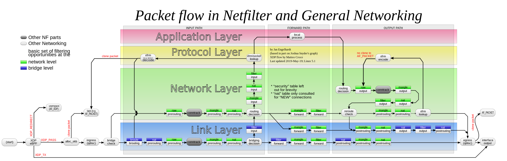

# iptables

iptables 是一个用户空间使用程序，它允许系统管理员配置 Linux 内核空间的 IP 数据包过滤规则，这些规则被实现为不同的 Netfilter 模块。这些过滤器被不同的表所管理，表中包含如何处理网络流量包的规则链。当前，不同的内核模块被用于不同的协议：iptables 适用于 ipv4，ip6tables 适用于 ipv6，arptables 适用于 ARP，ebtables 适用于以太网帧。

## iptables 简介

iptablesl 由表、链、规则组成，表包含链，链又包含规则。目前，iptables 包含五张表，五条链。

+ filter：这是默认的表（如果没有传递 -t 选项）。包括三条内置的链 **INPUT**（目的地是本地 socket 的数据包），**OUTPUT**（本地产生的数据包），**FORWARD**（进行路由决策的数据包）。
+ nat：当遇到创建新连接的数据包时，该表被引用。包括四条内置链：**PREROUTING**（在数据包刚进入时对他们进行改变），**INPUT**，**OUTPUT**，**POSTROUTING**（在数据包将要离开时时对他们进行改变）。内核从3.7版本开始支持IPv6 NAT。
+ mangle：此表用于专门的数据包更改。到内核2.4.17为止，该表包含两条内置链：**POSTROUTING**和**OUTPUT**，从2.4.18开始，该表包含所有五条链。
+ raw：该表主要与 NOTRACK 目标合用以配置连接跟踪中的例外。它在 netfilter 中以更高的优先级注册，因此在 ip_conntrack 或者任何其他 IP 表之前被调用。包含以下两条链：**PREROUTING** 和 **OUTPUT**。
+ security：该表用于强制访问控制（Mandatory Access Control，MAC）网络规则，例如 SECMARK 和 CONNSECMARK 目标启用的规则。MAC 由 Linux安全模块（例如 SELinux）实现。security 表在 filter 表之后被调用，允许任何 filter 中的自主访问控制（Discretionary Access Control，DAC）规则在 MAC 规则之前生效。该表包含以下链：**INPUT**，**OUTPUT**，**FORWARD**。

iptables 中，不同的表具有不同的优先级，下表展示了这种关系。

|        Tables↓/Chains→        | PREROUTING | INPUT | FORWARD | OUTPUT | POSTROUTING |
| :---------------------------: | :--------: | :---: | :-----: | :----: | :---------: |
|      (routing decision)       |            |       |         |   ✓    |             |
|            **raw**            |     ✓      |       |         |   ✓    |             |
| (connection tracking enabled) |     ✓      |       |         |   ✓    |             |
|          **mangle**           |     ✓      |   ✓   |    ✓    |   ✓    |      ✓      |
|        **nat** (DNAT)         |     ✓      |       |         |   ✓    |             |
|      (routing decision)       |     ✓      |       |         |   ✓    |             |
|          **filter**           |            |   ✓   |    ✓    |   ✓    |             |
|         **security**          |            |   ✓   |    ✓    |   ✓    |             |
|        **nat** (SNAT)         |            |   ✓   |         |        |      ✓      |

对于上表，从左向右看展示了每张 iptables 表所包含的链，从上向下看展示了当 netfilter 钩子被触发时每条链的调用顺序。在上表中，net 表被分成了 DNAT 和 SNAT 以更清晰地展示他们的顺序。同时，上表还包含了表示进行路由决策和启用连接跟踪的点的行，以便更全面地了解 iptables 中发生的过程。

## 选项

### -t, --table *table*

指定要操作的表 *table*。

### -A, --append *chain rule-specification*

在选定的链后追加一条或多条规则。当源和/或目的名称解析为超过一个地址时，规则会被添加到每一个可能的地址组合。

### -C, --check *chain rule-specification*

检查在选定的链中是否存在一条匹配 specification* 的规则。该规则使用与 -D 相同的逻辑查找匹配的条目，但是不会改变现存的 iptables 配置并且会通过退出码表明成功或失败。

### -D, --delete *chain rule-specification*

### -D, --delete *chain* *rulenum*

从选定的链中删除一条或多条规则。该命令有两个版本：可以通过链中的编号（第一条规则从1开始）或匹配来指定一条规则。

### -I, --insert *chain* [*rulenum*] *rule-specification*

以给定的规则编号在选定的链中插入一条或多条规则。所以，如果编号是1，规则会在链首插入。如果没有指定规则编号，这是默认行为。

### -R, --replace *chain rulenum rule-specification*

替换选定的链中的某条规则。如果源和/或目的名字解析得到多个地址，命令会失败。规则从1开始编号。

### -L, --list [*chain*]

列出选定链的所有规则。不指定链则列出所有链的规则。类似于每一个其他的 iptables 命令，该命令适用于特定的表（默认为 filter），所以 NAT 规则通过 `iptables -t nat -n -L` 列出。注意通常使用 -n 选项以避免长时间的反向 DNS 解析。同时使用 -Z 选项是合法的，在这种情况下链会被自动列出并清零。确切的输出受给定的其他参数的影响。

### -S, --list-rules [*chain*]

打印给定链的所有规则。不指定则打印所有链。类似于每一个其他的 iptables 命令，该命令适用于特定的表（默认为 filter）。

### -F, --flush [*chain*]

清空选定的链（不指定则删除表中所有的链）。这等同于逐条删除所有规则。

### -Z, --zero [*chain* [*rulenum*]]

清空给定的或所有链上的数据包和字节计数器。与 -L, --list 选项合用是合法的，可以在计数器清空之前立即查看他们。

### -N, --new-chain *chain*

根据给定的名字创建一条用户自定义链。必须不能有以该名字为目标的 target 存在。

### -X, --delete-chain [*chain*]

删除指定的链。必须没有对该链的引用。如果有需要在删除链之前删除或替换引用的规则。链必须是空的，也就是说不包含任何规则。不指定则删除表中的所有空链。空的内置链只能通过 iptables-nft 删除。

### -P, --policy *chain* *target*

将内置链（非用户定义）的策略设置为给定的 target。策略 target 必须是 ACCEPT 或者 DROP。

### -E, --rename-chain *old-chain new-chain*

将用户指定的链重命名。

### -h

帮助。给出命令语法的简短描述。

## 参数

下列参数组成了规则规范。

### -4, --ipv4

该参数在 iptables 和 iptables-restore 中没有作用。如果一条使用 -4 选项的规则被 ip6tables-restore 插入（并且仅与ip6ables restore一同插入），那么它会被忽略。任何其他的使用都会抛出错误。此选项允许在单个规则文件中使用 IPv4 和 IPv6 规则以同时使用 iptables-restore 和 ip6tables-restore。

### -6, --ipv6

作用与 -4 选项类似。

### [!] -p, --protocol *protocol*

规则或者数据包要检查的协议。指定的协议可以是 tcp，udp，udplite，icmp，icmpv6，esp，ah，sctp，mh 或者特殊关键字 all，或者一个表示这些协议的数值。`/etc/protocols` 中的协议也是允许的。协议之前的 ! 逆转了测试结果。数字0等价于 all。all 匹配所有协议并且在参数忽略时作为默认值。注意，在 ip6tables 中，除了 esp 以外，其他 IPv6 扩展首部都是不被允许的。esp 和 ipv6-nonext 在内核2.6.11以及之后的版本中可以被使用。数字0等价于 all，这意味着对于0值不能直接测试协议域。为了匹配 HBH 首部，即使它是最后一个首部也不能使用 -p 0，但是总是可以使用 -m hbh。

### [!] -s, --source *address*[/mask]\[,...]

指定源地址。*Address* 可以是一个网络名，主机名，IP 地址掩码或者一个普通的 IP 地址。在规则被提交给内核之前，主机名仅会被解析一次。请注意，指定任何一个需要远程请求（例如 DNS）来解析的名字都是一个坏主意。*mask* 可以是一个 ipv4 网络掩码（对于 iptables），或者一个普通数字，指定了网络掩码左侧的1的数量。例如，一个 iptables 掩码24等价于 255.255.255.0。地址规范前的 ! 参数反转了地址的含义。标志 --src 是该选项的简写。可以指定多个地址，但是这会扩展到多条规则（当使用 -A 时），或者导致多条规则被删除（使用 -D）。

### [!] -d, --destination *address*[/mask]\[,...]

与 -s 类似，简写是 --dst。

### -j, --jump *target*

指定规则的目标；也就是数据包匹配后的动作。target 可以是用户定义的链（除了该规则所在的链），一个决定了数据包接下来命运的内置目标，或者一个扩展（参考 EXTENSIONS）。如果在规则中省略了此选项（并且未使用-g），那么匹配规则将不会影响数据包的命运，但规则上的计数器将递增。

### -g, --goto *chain*

这指定处理应在用户指定的链中继续。与--jump选项不同，return不会在这个链中继续处理，而是在通过--jump调用我们的链中继续。

### [!] -i, --in-interface *name*

通过其接收数据包的接口的名称（仅适用于进入INPUT、FORWARD和PREROUTING链的数据包）。当在接口名称之前使用“!”参数时，其含义将颠倒。如果接口名称以“+”结尾，则以该名称开头的任何接口都将匹配。如果省略此选项，则任何接口名称都将匹配。

### [!] -o, --out-interface *name*

将通过其发送数据包的接口的名称（用于进入FORWARD、OUTPUT和POSTROUTING链的数据包）。当在接口名称之前使用“!”参数时，其含义是相反的。如果接口名称以“+”结尾，则以该名称开头的任何接口都将匹配。如果省略此选项，则任何接口名称都将匹配。

### [!] -f, --fragment

这意味着该规则仅涉及分片数据包的第二个及之后的IPv4分片。由于无法告诉此类数据包的源端口或目标端口（或ICMP类型），因此此类数据包将不匹配指定它们的任何规则。当“!”参数位于“-f”标志之前时，规则将仅匹配头部分片或未分片的数据包。此选项是 IPv4 特定的，在 ip6tables 中不可用。

### -c, --set-counters *packets* *bytes*

该选项使得管理员能够初始化数据包和字节计数器（在 INSERT，APPEND 和 REPLACE 操作期间）。

## 其他选项

### -v, --verbose

详细输出。

### -V, --version

打印打印程序版本和所用的内核 API。

### -w, --wait [*seconds*]

等待 xtables 锁。为了避免多个程序实例同时运行，程序装载时会尝试获取互斥锁。默认地，如果锁不能被获取则程序退出。*seconds* 可以指定程序获取锁之前的等待时间。

### -n, --numeric

数字化输出。IP 地址和端口号会以数字的形式输出。

### -x, --exact

显示数据包和字节计数器的精确值。

### --line-numbers

列出规则时，在前面添加行号。

### --modprobe=*command*

当向链中插入或添加一条规则时，使用 *command* 来装载任何需要的模块。

## 扩展

[iptables-extensions](https://man7.org/linux/man-pages/man8/iptables-extensions.8.html) match 扩展和 target 扩展为标准 iptables 提供更强大的功能。

## 参考文献

[iptables(8) - Linux man page](https://man7.org/linux/man-pages/man8/iptables.8.html)

[iptables](https://en.wikipedia.org/wiki/Iptables)

[A Deep Dive into Iptables and Netfilter Architecture](https://www.digitalocean.com/community/tutorials/a-deep-dive-into-iptables-and-netfilter-architecture)
